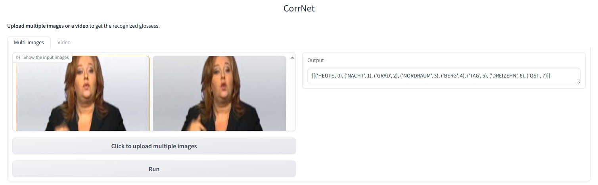

# CorrNet_CSLR
This repo holds codes of the paper: Continuous Sign Language Recognition with Correlation Network. (CVPR 2023) [[paper]](https://arxiv.org/abs/2303.03202)

This repo is based on [VAC (ICCV 2021)](https://openaccess.thecvf.com/content/ICCV2021/html/Min_Visual_Alignment_Constraint_for_Continuous_Sign_Language_Recognition_ICCV_2021_paper.html). Many thanks for their great work!

(Update on 2024/04/17) We release [**CorrNet+**](https://github.com/hulianyuyy/CorrNet_Plus), an unified model with superior performance on both **continuous sign language recognition** and **sign language translation** tasks by using **only RGB inputs**.

(Update on 2025/01/28) We release a demo for Continuous sign language recognition that supports multi-images and video inputs! You can watch the demo video to watch its effects, or deploy a demo locally to test its performance. 


<div align=center>
The demo video
</div>

## Prerequisites

- This project is implemented in Pytorch (better >=1.13 to be compatible with ctcdecode or these may exist errors). Thus please install Pytorch first.

- ctcdecode==0.4 [[parlance/ctcdecode]](https://github.com/parlance/ctcdecode)，for beam search decode. (ctcdecode is only supported on the Linux platform.)

- [Optional] sclite [[kaldi-asr/kaldi]](https://github.com/kaldi-asr/kaldi), install kaldi tool to get sclite for evaluation. After installation, create a soft link toward the sclite: 
  `mkdir ./software`
  `ln -s PATH_TO_KALDI/tools/sctk-2.4.10/bin/sclite ./software/sclite`

   You may use the python version evaluation tool for convenience (by setting 'evaluate_tool' as 'python' in line 16 of ./configs/baseline.yaml), but sclite can provide more detailed statistics.

- You can install other required modules by conducting 
   `pip install -r requirements.txt`

## Implementation
The implementation for the CorrNet (line 18) is given in [./modules/resnet.py](https://github.com/hulianyuyy/CorrNet_CSLR/blob/main/modules/resnet.py).  

It's then equipped with the BasicBlock in ResNet in line 58 [./modules/resnet.py](https://github.com/hulianyuyy/CorrNet_CSLR/blob/main/modules/resnet.py).

We later found that the Identification Module with only spatial decomposition could perform on par with what we report in the paper (spatial-temporal decomposition) and is slighter faster, and thus implement it as such.

## Data Preparation
You can choose any one of following datasets to verify the effectiveness of CorrNet.

### PHOENIX2014 dataset
1. Download the RWTH-PHOENIX-Weather 2014 Dataset [[download link]](https://www-i6.informatik.rwth-aachen.de/~koller/RWTH-PHOENIX/). Our experiments based on phoenix-2014.v3.tar.gz.

2. After finishing dataset download, extract it. It is suggested to make a soft link toward downloaded dataset.   
   `ln -s PATH_TO_DATASET/phoenix2014-release ./dataset/phoenix2014`

3. The original image sequence is 210x260, we resize it to 256x256 for augmentation. Run the following command to generate gloss dict and resize image sequence.     

   ```bash
   cd ./preprocess
   python dataset_preprocess.py --process-image --multiprocessing
   ```

### PHOENIX2014-T dataset
1. Download the RWTH-PHOENIX-Weather 2014 Dataset [[download link]](https://www-i6.informatik.rwth-aachen.de/~koller/RWTH-PHOENIX-2014-T/)

2. After finishing dataset download, extract it. It is suggested to make a soft link toward downloaded dataset.   
   `ln -s PATH_TO_DATASET/PHOENIX-2014-T-release-v3/PHOENIX-2014-T ./dataset/phoenix2014-T`

3. The original image sequence is 210x260, we resize it to 256x256 for augmentation. Run the following command to generate gloss dict and resize image sequence.     

   ```bash
   cd ./preprocess
   python dataset_preprocess-T.py --process-image --multiprocessing
   ```

If you get an error like ```IndexError: list index out of range``` on the PHOENIX2014-T dataset, you may refer to [this issue](https://github.com/hulianyuyy/CorrNet/issues/10#issuecomment-1660363025) to tackle the problem.

### CSL dataset

1. Request the CSL Dataset from this website [[download link]](https://ustc-slr.github.io/openresources/cslr-dataset-2015/index.html)

2. After finishing dataset download, extract it. It is suggested to make a soft link toward downloaded dataset.   
   `ln -s PATH_TO_DATASET ./dataset/CSL`

3. The original image sequence is 1280x720, we resize it to 256x256 for augmentation. Run the following command to generate gloss dict and resize image sequence.     

   ```bash
   cd ./preprocess
   python dataset_preprocess-CSL.py --process-image --multiprocessing
   ``` 

### CSL-Daily dataset

1. Request the CSL-Daily Dataset from this website [[download link]](http://home.ustc.edu.cn/~zhouh156/dataset/csl-daily/)

2. After finishing dataset download, extract it. It is suggested to make a soft link toward downloaded dataset.   
   `ln -s PATH_TO_DATASET ./dataset/CSL-Daily`

3. The original image sequence is 1280x720, we resize it to 256x256 for augmentation. Run the following command to generate gloss dict and resize image sequence.     

   ```bash
   cd ./preprocess
   python dataset_preprocess-CSL-Daily.py --process-image --multiprocessing
   ``` 

## Inference

### PHOENIX2014 dataset

| Backbone | Dev WER  | Test WER  | Pretrained model                                             |
| -------- | ---------- | ----------- | --- |
| ResNet18 | 18.8%      | 19.4%       | [[Baidu]](https://pan.baidu.com/s/1DIGts18fdh4Fdw_y7ZQ6XA) (passwd: skd3)<br />[[Google Drive]](https://drive.google.com/file/d/1Xt_4N-HjEGlVyrMENydsxNtpVMSg5zDb/view?usp=share_link) |

We wrongly delete the original checkpoint and retrain the model with similar accuracy (Dev: 18.9%, Test: 19.7%)

### PHOENIX2014-T dataset

| Backbone | Dev WER  | Test WER  | Pretrained model                                             |
| -------- | ---------- | ----------- | --- |
| ResNet18 | 18.9%      | 20.5%       | [[Baidu]](https://pan.baidu.com/s/1osUDzpPhKPDavxyvqOrVfQ) (passwd: deuq)<br />[[Google Drive]](https://drive.google.com/file/d/1c_wNHYMqCbqRE5KqrQL1P6chOw5VBS6Q/view?usp=share_link) |

### CSL-Daily dataset

To evaluate upon CSL-Daily with this checkpoint, you should remove the CorrNet block after layer2, i.e., comment line 102 and 145 in resnet.py and change the num from 3 to 2 in line 105, change self.alpha[1] & self.alpha[2] to self.alpha[0] & self.alpha[1] in line 147 & 149, respectively.

| Backbone | Dev WER  | Test WER  | Pretrained model                                            |
| -------- | ---------- | ----------- | --- |
| ResNet18 | 30.6%      | 30.1%       | [[Baidu]](https://pan.baidu.com/s/1WzNltivGRbfV33wkM4rzjg) (passwd: u2iv)<br />[[Google Drive]](https://drive.google.com/file/d/1-aSKPe9cVkvHeiJuyQm3HlZ5u63CI-mm/view?usp=share_link) |


​	To evaluate the pretrained model, choose the dataset from phoenix2014/phoenix2014-T/CSL/CSL-Daily in line 3 in ./config/baseline.yaml first, and run the command below：   
`python main.py --config ./config/baseline.yaml --device your_device --load-weights path_to_weight.pt --phase test`

### Training

The priorities of configuration files are: command line > config file > default values of argparse. To train the SLR model, run the command below:

`python main.py --config ./config/baseline.yaml --device your_device`

Note that you can choose the target dataset from phoenix2014/phoenix2014-T/CSL/CSL-Daily in line 3 in ./config/baseline.yaml.
 
For CSL-Daily dataset, You may choose to reduce the lr by half from 0.0001 to 0.00005, change the lr deacying rate (gamma in the 'optimizer.py') from 0.2 to 0.5, and disable the temporal resampling strategy (comment line 121 in dataloader_video.py).

### Visualizations
For Grad-CAM visualization, you can replace the resnet.py under "./modules" with the resnet.py under "./weight_map_generation", and then run ```python generate_cam.py``` with your own hyperparameters.

### Test with one video input
Except performing inference on datasets, we provide a `test_one_video.py` to perform inference with only one video input. An example command is 
```
python test_one_video.py --model_path /path_to_pretrained_weights --video_path /path_to_your_video --device your_device
```
The `video_path` can be the path to a video file or a dir contains extracted images from a video.

Acceptable paramters:
- `model_path`, the path to pretrained weights.
- `video_path`, the path to a video file or a dir contains extracted images from a video.
- `device`, which device to run inference, default=0.
- `language`, the target sign language, default='phoenix', choices=['phoenix', 'csl'].
- `max_frames_num`, the max input frames sampled from an input video, default=360.

### Demo
We provide a demo to allow deploying continuous sign language recognition models locally to test its effects. The demo page is shown as follows.
<div align=center>

<h4> The page of our demo</h4>
</div>
The demo video can be found in the top of this page. An example command is 
```
python demo.py --model_path /path_to_pretrained_weights --device your_device
```

Acceptable paramters:
- `model_path`, the path to pretrained weights.
- `device`, which device to run inference, default=0.
- `language`, the target sign language, default='phoenix', choices=['phoenix', 'csl'].
- `max_frames_num`, the max input frames sampled from an input video, default=360.

After running the command, you can visit `http://0.0.0.0:7862` to play with the demo. You can also change it into an public URL by setting `share=True` in line 176 in `demo.py`.
### Citation

If you find this repo useful in your research works, please consider citing:

```latex
@inproceedings{hu2023continuous,
  title={Continuous Sign Language Recognition with Correlation Network},
  author={Hu, Lianyu and Gao, Liqing and Liu, Zekang and Feng, Wei},
  booktitle={Proceedings of the IEEE/CVF International Conference on Computer Vision},
  year={2023},
}
```